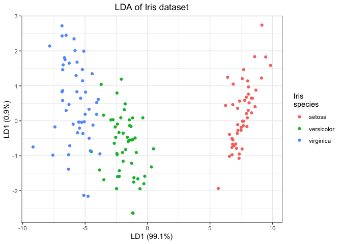

Computing and visualizing LDA in R
================
Joshua Cook
10/28/2019

## Overview

Linear Discriminant Analysis (LDA) find the optimal separation of
predifed-classes in a data set. It maximizes the separation between the
means of the groups and minimizes the scatter within the groups. A good
video was made by StatsQuest on LDA: [*StatQuest: Linear Discriminant
Analysis (LDA) clearly
explained.*](https://www.youtube.com/watch?v=azXCzI57Yfc)

Here, I followed the tutorial from R-Bloggers [*Computing and
visualizing LDA in
R*](https://www.r-bloggers.com/computing-and-visualizing-lda-in-r/). At
the end, I also found an article that introduced QDA: [*Discriminant
Function
Analysis*](https://www.statmethods.net/advstats/discriminant.html) STHDA
goes into Mixture, Flexible, and Regularized Discriminant Analysis, too,
in their tutorial [*Discriminant Analysis Essentials in
R*](http://www.sthda.com/english/articles/36-classification-methods-essentials/146-discriminant-analysis-essentials-in-r/#mixture-discriminant-analysis).
**(I have yet to do this, but will return, soon.)**

## LDA

### Basics

We will find the maximum separation between te species of Iris flower in
the `iris` data set.

``` r
iris
```

    ## # A tibble: 150 x 5
    ##    sepal_length sepal_width petal_length petal_width species
    ##           <dbl>       <dbl>        <dbl>       <dbl> <fct>  
    ##  1          5.1         3.5          1.4         0.2 setosa 
    ##  2          4.9         3            1.4         0.2 setosa 
    ##  3          4.7         3.2          1.3         0.2 setosa 
    ##  4          4.6         3.1          1.5         0.2 setosa 
    ##  5          5           3.6          1.4         0.2 setosa 
    ##  6          5.4         3.9          1.7         0.4 setosa 
    ##  7          4.6         3.4          1.4         0.3 setosa 
    ##  8          5           3.4          1.5         0.2 setosa 
    ##  9          4.4         2.9          1.4         0.2 setosa 
    ## 10          4.9         3.1          1.5         0.1 setosa 
    ## # … with 140 more rows

``` r
iris_lda <- MASS::lda(species ~ ., data = iris)
iris_lda
```

    ## Call:
    ## lda(species ~ ., data = iris)
    ## 
    ## Prior probabilities of groups:
    ##     setosa versicolor  virginica 
    ##  0.3333333  0.3333333  0.3333333 
    ## 
    ## Group means:
    ##            sepal_length sepal_width petal_length petal_width
    ## setosa            5.006       3.428        1.462       0.246
    ## versicolor        5.936       2.770        4.260       1.326
    ## virginica         6.588       2.974        5.552       2.026
    ## 
    ## Coefficients of linear discriminants:
    ##                     LD1         LD2
    ## sepal_length  0.8293776  0.02410215
    ## sepal_width   1.5344731  2.16452123
    ## petal_length -2.2012117 -0.93192121
    ## petal_width  -2.8104603  2.83918785
    ## 
    ## Proportion of trace:
    ##    LD1    LD2 
    ## 0.9912 0.0088

The coefficients for each covariate, accessible via `iris_lda$scaling`,
indicate the linear combination coefficients for each linear
discriminant.

We can use the singular values (`iris_lda$svd`) to compute the amount of
between-group variance that is explation be each linear discriminant.

``` r
iris_lda_proportions <- (iris_lda$svd^2) / sum(iris_lda$svd^2)
iris_lda_proportions
```

    ## [1] 0.991212605 0.008787395

These results indicate that the first linear discriminant explains more
than 99% of the between group variance.

### Cross validation

We can pass `TRUE` to the `CV` argument in `MASS::lda()` to intruct it
to conduct leave-one-out cross validation.

``` r
iris_lda_cv <- MASS::lda(species ~ ., data = iris, CV = TRUE)
```

This returns a list with some new data. The `class` list indicates the
maximum a posteriori probability (MAP) classification.

``` r
head(iris_lda_cv$class)
```

    ## [1] setosa setosa setosa setosa setosa setosa
    ## Levels: setosa versicolor virginica

The `posterior` list has the posterior probabilities for each class.

``` r
head(iris_lda_cv$posterior)
```

    ##   setosa   versicolor    virginica
    ## 1      1 5.087494e-22 4.385241e-42
    ## 2      1 9.588256e-18 8.888069e-37
    ## 3      1 1.983745e-19 8.606982e-39
    ## 4      1 1.505573e-16 5.101765e-35
    ## 5      1 2.075670e-22 1.739832e-42
    ## 6      1 5.332271e-21 8.674906e-40

### Predictions

We can use an `lda` model to make predictions on new data. That is shown
here by splitting the original `iris` data set into training and testing
data sets.

``` r
# Index of rows to use for training
train_idx <- sample(1:nrow(iris), 0.8 * nrow(iris))

# LDA of iris with only training subset.
iris_lda <- lda(species ~ ., data = iris, subset = train_idx)

# Make predictions on test data.
lda_predictions <- predict(object = iris_lda,
                           newdata = iris[-train_idx, ])
```

We can assess the predictions made by the LDA model using the `class`
and `posterior` values in the returned object. The `x` value also has
the projects of the data point on the linear discriminants.

``` r
table(iris$species[-train_idx], lda_predictions$class)
```

    ##             
    ##              setosa versicolor virginica
    ##   setosa         13          0         0
    ##   versicolor      0         10         0
    ##   virginica       0          0         7

### Plotting

``` r
iris_lda <- lda(species ~ ., data = iris)
iris_lda_proportions <- round((iris_lda$svd^2) / sum(iris_lda$svd^2) * 100, 1)
predict(object = iris_lda, newdata = iris)$x %>%
    as_tibble() %>% 
    mutate(species = iris$species) %>% 
    ggplot(aes(x = LD1, y = LD2)) +
    geom_point(aes(color = species)) +
    theme_bw() +
    theme(
        plot.title = element_text(hjust = 0.5)
    ) +
    labs(
        x = glue::glue("LD1 ({iris_lda_proportions[[1]]}%)"),
        y = glue::glue("LD1 ({iris_lda_proportions[[2]]}%)"),
        title = "LDA of Iris dataset",
        color = "Iris\nspecies"
    )
```

<!-- -->

### Quadratic discriminant analysis

Quadratic discriminant analysis, QDA, is similar to LDA but does not
assume homogineity of the variance-covariance matrix.

``` r
iris_qda <- MASS::qda(species ~ ., data = iris)
iris_qda
```

    ## Call:
    ## qda(species ~ ., data = iris)
    ## 
    ## Prior probabilities of groups:
    ##     setosa versicolor  virginica 
    ##  0.3333333  0.3333333  0.3333333 
    ## 
    ## Group means:
    ##            sepal_length sepal_width petal_length petal_width
    ## setosa            5.006       3.428        1.462       0.246
    ## versicolor        5.936       2.770        4.260       1.326
    ## virginica         6.588       2.974        5.552       2.026

For these data, it does not improve upon LDA.

``` r
table(iris$species, predict(iris_lda, newdata = iris)$class)
```

    ##             
    ##              setosa versicolor virginica
    ##   setosa         50          0         0
    ##   versicolor      0         48         2
    ##   virginica       0          1        49

``` r
table(iris$species, predict(iris_qda, newdata = iris)$class)
```

    ##             
    ##              setosa versicolor virginica
    ##   setosa         50          0         0
    ##   versicolor      0         48         2
    ##   virginica       0          1        49
